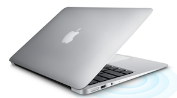

# Computer Requirements

[1. Computer Specs](#section-a)  
[2. Mac vs Windows](#section-b)  
[3. Docker Requirements](#section-c) 

---

## 1.  Computer Specs

You will need a laptop that has access to Unix operating system (Mac or Ubuntu) with these *at least these minimum* specs:
- memory: at least 8GB RAM
- processor: at least 2GHz
- storage: at least 100 GB HD

### Notes
- **Chromebooks** are not adequate for use in the bootcamp
- **Windows 10** can optionally run Ubuntu simultaneously. However, this option is currently **not recommended** as there are subtle differences between this setup, which simultaneously runs both operating systems, and a virtual machine or a dual boot system. If students choose to try it, they should be warned that instructors may not be able to assist them and they may need to switch to a real virtual machine if problems persist. 

---

## 2.  Mac vs Windows

### Case for Mac over Windows

**Most people use Macs. They *are* expensive, but they work really well and they have a Linux-similar operating system that lets you just get down to business.  That way, you can spend more time on data science and less time trouble-shooting.**  

**The bootcamp is intense.  Spending time wrestling with compatibility stuff you really don't have to has a high opportunity cost.**  

Many Windows users aren’t used to using their computers in the full range of ways that are necessary. In summary, we find that things are more difficult to set up on Windows, and Windows users are less comfortable setting up even simple things. This common combination leads to large productivity hurdles and setbacks to class progress when everyone has to wait for a Windows user to get individual help. On top of this, it's common for productive data scientists to not use Windows, and in particular the instructional staff at Metis **does not** and **should not** spend their time troubleshooting Windows issues.

Specific Examples (of what's more difficult on Windows):
* setting PATH
* installing common packages
* installing a compiler toolchain
* accessing compressed files
* downloading remote files
* using X windows
* writing shell scripts
* scheduling tasks

Windows is discouraged, but some people are actually productive on Windows. It’s like an evolutionary disadvantage; if you’re successful anyway it sometimes means your other traits are quite good.  If you really want to run Windows, maybe you should. But we don’t like to put students in a position where we can’t help them, and **we don’t support Windows.**

If you want to spend time learning how to configure things, I recommend learning how to configure Linux over learning how to configure Windows.

### Running Windows - Don't Do It

**Q:  Can I run Windows for the bootcamp, instead of Unix or Linux?**  
A: The short answer is this: **Don't run Windows.**

The slightly longer answer is that it is possible to run Windows, but everything is harder. I've never had a student do the class with Windows. I had a student start the class with Windows, but by the second day that student went out and bought a new computer because it was too hard to keep up in Windows.

### If not Mac, if not Windows, then ---> Linux

You don't necessarily need to buy a new computer. Here are some alternatives:

 * **Linux Virtual Machine:**  If your computer is fairly powerful, you could run a Linux Virtual Machine inside your normal Windows install. This requires some configuration, but at least you end up with a working Linux instead of having to try to make Windows do things.
 * **Install Linux on your computer instead of or alongside Windows:**  Then you can boot to Linux instead of booting to Windows. Again, there is a good deal of configuration to be done to get this to work well, in general. We've had a couple people do the class with Linux this way.
 * **EC2:**  You could `ssh` into a remote Linux machine on EC2 and do all your work there. This requires some setup but perhaps less than the above two options. You'll mostly forgo a graphical interface, most likely, and you'll be paying for your computing by the hour.
 * **Git Bash:** You could try to use git-bash and/or other tools to try to make Windows achieve the functionality of Linux/MacOS. This becomes pretty frustrating pretty frequently and may limit the tools you can use.

### Which type of Linux?

So you've decided to install Linux on your computer or in a virtual machine? Which kind should you install?

If you have limited experience with Linux (i.e. if you have to ask the question about which kind of Linux to install), then you should **install Ubuntu.** There are quirks to each version of Linux, so it's best to choose something the instructors and TAs are familiar with.

If you have a lot of familiarity with Linux (say > 1 year), then you may install whatever kind you are most familiar with. Recognize that the instructors may only be able to offer limited assistance if you do so.

---

## 3.  Docker Requirements

### Docker
We will be using [Docker](https://www.docker.com/what-docker) for software installations during the bootcamp.  

#### Docker on Mac
Running Docker for Mac requires Mac OS X 10.10.3 Yosemite or newer. Your Mac must be a 2010 or newer model, with Intel’s hardware support for memory management unit (MMU) virtualization; i.e., Extended.

#### Docker on AWS Ubuntu
There is the option to install Docker on an AWS Ubuntu instance.  

